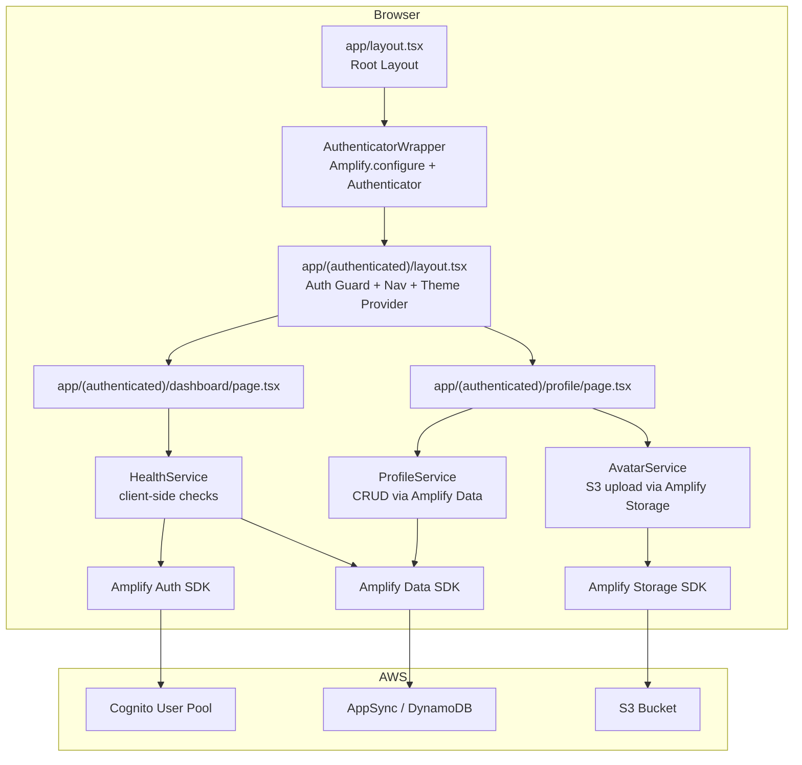
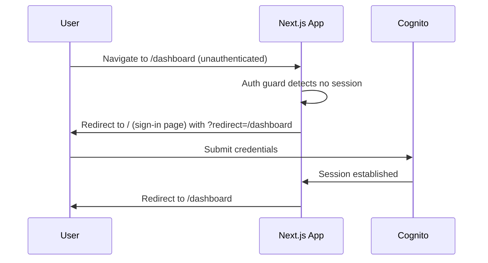
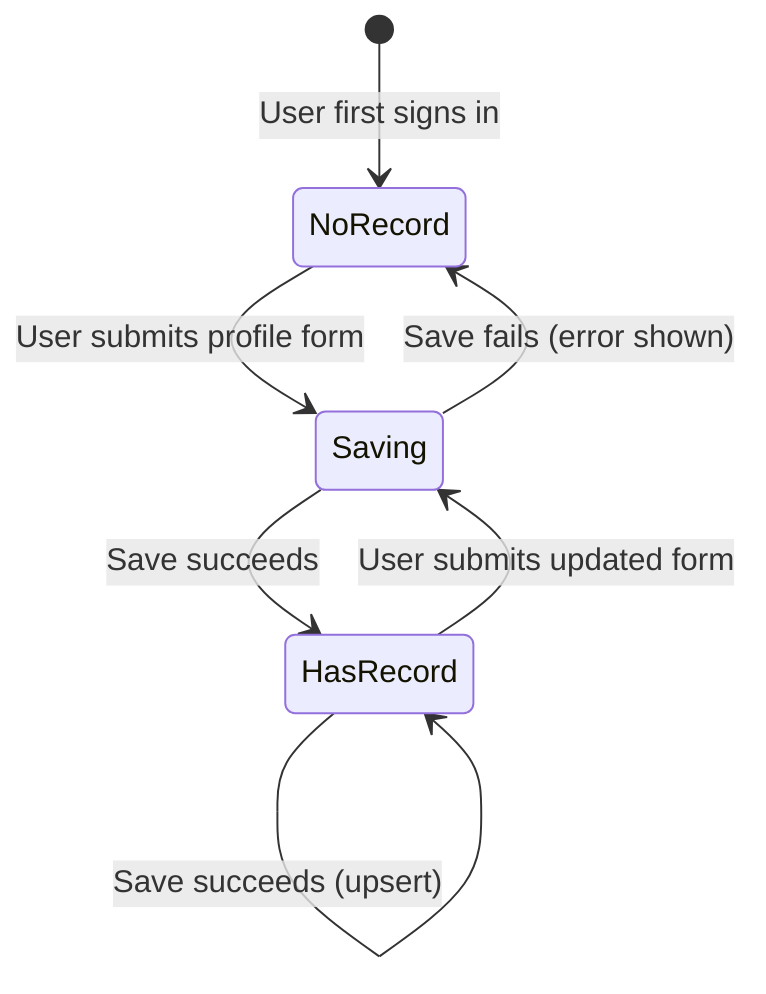

# Design Document: Dashboard and Profile

## Overview

This feature adds two authenticated routes — `/dashboard` and `/profile` — to the existing Next.js 14 App Router + AWS Amplify Gen 2 application. After signing in, users land on the dashboard, which shows real-time health cards for backend services. From there they can navigate to the profile page to manage their display name, avatar, bio, theme preference, and notification preferences.

The design extends the existing Amplify Gen 2 backend with a `UserProfile` data model (DynamoDB) and an S3 storage resource for avatars. A shared authenticated layout wraps both routes, providing the responsive navigation component and theme application.

### Key Design Decisions

1. **Authenticated layout via Next.js route groups** — A `(authenticated)` route group holds a shared `layout.tsx` that renders the Nav and enforces auth. This avoids duplicating auth checks in every page component.
2. **Theme via `data-theme` attribute on `<html>`** — CSS custom properties scoped to `[data-theme="dark"]` allow instant theme switching without a page reload or full re-render.
3. **Health checks are pure client-side** — The Health Service runs in the browser using the Amplify client SDK. No server-side API route is needed, which keeps the architecture simple and avoids cold-start latency.
4. **Profile upsert pattern** — The data layer uses a single `save` operation that creates or updates the record, keyed by the Cognito `sub`. This satisfies the one-record-per-user requirement without a separate create/update branch in the UI.
5. **Owner-based authorization** — Both the DynamoDB model and S3 storage use Amplify's `owner` authorization so each user can only access their own data.

---

## Architecture



### Request Flow — Post-Login Redirect



---

## Components and Interfaces

### File Structure

```
app/
├── layout.tsx                          # Root layout (Amplify config, fonts)
├── page.tsx                            # Sign-in page (existing, updated to redirect)
├── globals.css                         # Global styles + CSS custom properties for themes
├── (authenticated)/
│   ├── layout.tsx                      # Auth guard + Nav + ThemeProvider
│   ├── dashboard/
│   │   └── page.tsx                    # Dashboard page
│   └── profile/
│       └── page.tsx                    # Profile page
├── components/
│   ├── Nav.tsx                         # Responsive navigation component
│   ├── Nav.module.css
│   ├── HealthCard.tsx                  # Single health status card
│   ├── HealthCard.module.css
│   ├── ProfileForm.tsx                 # Profile edit form
│   ├── ProfileForm.module.css
│   └── AvatarUpload.tsx                # Avatar file picker + preview
amplify/
├── backend.ts                          # Updated: adds data + storage
├── auth/resource.ts                    # Existing
├── data/resource.ts                    # New: UserProfile schema
└── storage/resource.ts                 # New: avatar S3 bucket
lib/
├── health-service.ts                   # Health check logic
├── profile-service.ts                  # Profile CRUD
└── theme-utils.ts                      # Theme application helpers
```

### Nav Component

```typescript
// app/components/Nav.tsx
interface NavProps {
  displayName: string | null;   // null → show email
  email: string;
  activePath: string;           // current pathname for active link styling
  onSignOut: () => void;
}
```

Renders as a `<nav>` element. Uses a CSS media query at 768 px to switch between sidebar (`position: fixed; left: 0`) and top bar (`position: sticky; top: 0`) layouts via CSS module classes.

### HealthCard Component

```typescript
// app/components/HealthCard.tsx
type HealthStatus = 'checking' | 'healthy' | 'unavailable';

interface HealthCardProps {
  label: string;           // e.g. "Auth Connectivity"
  status: HealthStatus;
  detail?: string;         // e.g. "Expires in 45 min" for auth card
}
```

### ProfileForm Component

```typescript
// app/components/ProfileForm.tsx
interface ProfileFormProps {
  initialValues: ProfileFormValues;
  onSubmit: (values: ProfileFormValues) => Promise<void>;
  isSaving: boolean;
}

interface ProfileFormValues {
  displayName: string;          // max 64 chars
  bio: string;                  // max 280 chars
  themePreference: 'light' | 'dark';
  notificationsEnabled: boolean;
}
```

### Health Service

```typescript
// lib/health-service.ts
export interface HealthCheckResult {
  name: string;
  status: 'healthy' | 'unavailable';
  detail?: string;
  checkedAt: string;   // ISO 8601
}

export interface HealthServiceConfig {
  timeoutMs: number;   // default 10_000
}

// Runs all checks concurrently; resolves within timeoutMs
export async function runHealthChecks(
  config?: HealthServiceConfig
): Promise<HealthCheckResult[]>

// Individual check functions (exported for unit testing)
export async function checkAuthSession(): Promise<HealthCheckResult>
export async function checkAmplifyApi(): Promise<HealthCheckResult>
export async function checkDataLayer(): Promise<HealthCheckResult>
```

### Profile Service

```typescript
// lib/profile-service.ts
export interface UserProfile {
  id: string;                          // Cognito sub (owner)
  displayName: string;
  bio: string;
  avatarUrl: string | null;
  themePreference: 'light' | 'dark';
  notificationsEnabled: boolean;
}

export async function getProfile(userId: string): Promise<UserProfile | null>
export async function saveProfile(profile: UserProfile): Promise<UserProfile>
```

### Theme Utilities

```typescript
// lib/theme-utils.ts
export type Theme = 'light' | 'dark';

export function applyTheme(theme: Theme): void   // sets data-theme on <html>
export function getAppliedTheme(): Theme          // reads data-theme from <html>
export function getDefaultTheme(): Theme          // returns 'light'
```

---

## Data Models

### Amplify Gen 2 Data Schema

```typescript
// amplify/data/resource.ts
import { type ClientSchema, a, defineData } from '@aws-amplify/backend';

const schema = a.schema({
  UserProfile: a
    .model({
      displayName: a.string().required(),
      bio: a.string(),
      avatarUrl: a.string(),
      themePreference: a.enum(['light', 'dark']),
      notificationsEnabled: a.boolean(),
    })
    .authorization((allow) => [allow.owner()]),
});

export type Schema = ClientSchema<typeof schema>;
export const data = defineData({ schema });
```

The `owner` authorization rule automatically adds an `owner` field (set to the Cognito `sub`) and enforces that only the record owner can read or write it. Amplify creates exactly one record per user because the UI always calls `saveProfile` as an upsert (create if not exists, update otherwise).

### Amplify Gen 2 Storage

```typescript
// amplify/storage/resource.ts
import { defineStorage } from '@aws-amplify/backend';

export const storage = defineStorage({
  name: 'avatarStorage',
  access: (allow) => ({
    'avatars/{entity_id}/*': [
      allow.entity('identity').to(['read', 'write', 'delete']),
    ],
  }),
});
```

Avatar files are stored at `avatars/{cognitoIdentityId}/{filename}`. The `entity_id` token is resolved by Amplify to the caller's Cognito Identity Pool identity ID, ensuring owner-scoped access.

### Profile Record Lifecycle



### Theme Application

Theme is stored as `themePreference: 'light' | 'dark'` in DynamoDB. On load, the authenticated layout reads the profile and calls `applyTheme()`, which sets `data-theme="light"` or `data-theme="dark"` on the `<html>` element. CSS custom properties in `globals.css` are scoped to these selectors:

```css
:root,
[data-theme="light"] {
  --bg: #ffffff;
  --fg: #0a0a0a;
  --surface: #f5f5f5;
  --accent: #6649ae;
  /* ... */
}

[data-theme="dark"] {
  --bg: #0a0a0a;
  --fg: #ededed;
  --surface: #1a1a1a;
  --accent: #cbbeff;
  /* ... */
}
```

Changing the attribute is synchronous and triggers a CSS repaint within a single frame — well within the 300 ms requirement.

---

## Correctness Properties

*A property is a characteristic or behavior that should hold true across all valid executions of a system — essentially, a formal statement about what the system should do. Properties serve as the bridge between human-readable specifications and machine-verifiable correctness guarantees.*

The feature involves pure functions (validation logic, formatting, theme application, notification triggering) and data transformation logic that are well-suited to property-based testing. Infrastructure concerns (Amplify owner auth enforcement, S3 access control) are covered by integration tests instead.

---

### Property 1: HealthCard status-to-display mapping

*For any* `HealthCheckResult` with a given `status` value (`'healthy'`, `'unavailable'`, or `'checking'`), the rendered `HealthCard` component SHALL display the corresponding label ("Healthy", "Unavailable", or "Checking…") and apply the corresponding indicator CSS class (green, red, or neutral).

**Validates: Requirements 3.3, 3.4, 3.5**

---

### Property 2: Health check timeout enforcement

*For any* health check function that does not resolve within `timeoutMs` milliseconds, `runHealthChecks` SHALL resolve that check's result with `status: 'unavailable'`. *For any* health check function that resolves within `timeoutMs`, the result SHALL reflect the actual resolved value.

**Validates: Requirements 3.8**

---

### Property 3: ISO 8601 timestamp formatting

*For any* `Date` object representing the time of the most recent health check refresh, the string displayed on the Dashboard SHALL be a valid ISO 8601 datetime string (parseable by `new Date()` without producing `NaN`).

**Validates: Requirements 3.6**

---

### Property 4: Session expiry human-readable formatting

*For any* future expiry timestamp (in milliseconds), the formatted session expiry string SHALL contain a non-negative integer representing the remaining minutes and SHALL be human-readable (e.g., matches the pattern `"Expires in N min"`).

**Validates: Requirements 4.2**

---

### Property 5: Profile form pre-population

*For any* `UserProfile` object passed as `initialValues` to `ProfileForm`, every form field (displayName, bio, themePreference, notificationsEnabled) SHALL be rendered with the corresponding value from that object.

**Validates: Requirements 5.6, 8.5**

---

### Property 6: Profile form validation — invalid inputs rejected

*For any* displayName string that is empty, composed entirely of whitespace, or longer than 64 characters, submitting the profile form SHALL display a validation error message and SHALL NOT invoke `saveProfile`. *For any* bio string longer than 280 characters, submitting the profile form SHALL display a validation error message and SHALL NOT invoke `saveProfile`.

**Validates: Requirements 5.3, 5.4, 5.5**

---

### Property 7: Profile form submission — valid inputs accepted

*For any* displayName string with length between 1 and 64 characters (inclusive, non-whitespace-only) and any bio string with length between 0 and 280 characters (inclusive), submitting the profile form SHALL invoke `saveProfile` with exactly those displayName and bio values.

**Validates: Requirements 5.2**

---

### Property 8: Avatar file size validation

*For any* file object with `size > 5_242_880` bytes (5 MB), the avatar upload control SHALL display an error message and SHALL NOT invoke the storage upload function. *For any* file object with `size ≤ 5_242_880` bytes and a MIME type of `image/jpeg`, `image/png`, or `image/webp`, the upload control SHALL NOT display a size error.

**Validates: Requirements 6.2**

---

### Property 9: Avatar preview URL generation

*For any* valid image file (JPEG, PNG, or WebP, size ≤ 5 MB), selecting it in the avatar upload control SHALL produce a non-empty preview URL string that can be used as an `` `src` attribute.

**Validates: Requirements 6.3**

---

### Property 10: Avatar storage path owner-scoping

*For any* `userId` string and any valid image file, the storage key used when uploading the avatar SHALL contain the `userId` as a path segment (i.e., the key matches `avatars/{userId}/...`), ensuring the file is scoped to that user's identity.

**Validates: Requirements 6.4**

---

### Property 11: Theme application is immediate and correct

*For any* `Theme` value (`'light'` or `'dark'`), calling `applyTheme(theme)` SHALL synchronously set the `data-theme` attribute on the `<html>` element to that value, and `getAppliedTheme()` called immediately after SHALL return the same value.

**Validates: Requirements 7.4**

---

### Property 12: Notification alert behavior

*For any* sequence of health check result sets where at least one check transitions from `'healthy'` to `'unavailable'`: when `notificationsEnabled` is `true`, the notification system SHALL trigger an alert for each such transition; when `notificationsEnabled` is `false`, the notification system SHALL NOT trigger any alerts regardless of transitions.

**Validates: Requirements 8.3, 8.4**

---

### Property 13: Profile upsert — one record per user

*For any* `userId` string, saving a profile record N times (N ≥ 1) SHALL result in exactly one profile record associated with that `userId` in the data store, with the most recently saved values.

**Validates: Requirements 9.1, 9.2, 9.3**

---

### Property 14: Profile data round-trip

*For any* `UserProfile` object (with valid field values), saving it via `saveProfile` and then reading it back via `getProfile` SHALL return an object where all fields (displayName, bio, avatarUrl, themePreference, notificationsEnabled) are equal to the original values.

**Validates: Requirements 9.4**

---

### Property 15: Nav display name selection

*For any* `displayName` string and `email` string: when a profile record exists with that `displayName`, the Nav SHALL render the `displayName`; when no profile record exists, the Nav SHALL render the `email`.

**Validates: Requirements 2.3**

---

### Property 16: Nav active link highlighting

*For any* valid route path (`'/dashboard'` or `'/profile'`) passed as `activePath` to the Nav component, the navigation link corresponding to that path SHALL have the active CSS class applied, and the other link SHALL NOT have the active CSS class applied.

**Validates: Requirements 2.7**

---

### Property 17: URL preservation across auth redirect

*For any* valid authenticated route path (e.g., `/dashboard`, `/profile`), when an unauthenticated user navigates to that path, the auth guard SHALL store the path and, after successful authentication, SHALL redirect the user to that original path.

**Validates: Requirements 1.4**

---

### Property 18: Dashboard greeting contains user email

*For any* authenticated user email string, the Dashboard SHALL render a greeting element whose text content contains that email string.

**Validates: Requirements 3.9**

---

## Error Handling

### Auth Errors

- If `fetchAuthSession()` throws or returns no tokens, the Auth Status health card shows "Auth Unavailable" with a red indicator. The rest of the dashboard still renders with its own check results.
- If the auth session expires while the user is on an authenticated page, the `Authenticator` component handles re-authentication automatically (existing behavior).

### Health Check Errors

- Each individual check is wrapped in a `try/catch`. A thrown error maps to `status: 'unavailable'`.
- A `Promise.race` against a `setTimeout(timeoutMs)` ensures no check hangs indefinitely. Timed-out checks resolve as `'unavailable'`.
- Checks run concurrently via `Promise.allSettled` so one failure does not block others.

### Profile Save Errors

- `saveProfile` wraps the Amplify Data call in a `try/catch`. On failure it throws a typed `ProfileSaveError`.
- The `ProfileForm` component catches this error, sets an error state, and displays a user-facing message. The form fields retain their current (unsaved) values so the user can retry.
- The previously persisted data in DynamoDB is unchanged because the failed write never committed.

### Avatar Upload Errors

- Client-side validation (file type, file size) runs before any network call. Errors are shown immediately without touching S3.
- If the S3 upload call fails, `AvatarUpload` catches the error, displays a message, and leaves `avatarUrl` in the profile unchanged.
- If the subsequent `saveProfile` call (to update `avatarUrl`) fails after a successful S3 upload, the component shows an error. The orphaned S3 object is acceptable at this scale; a cleanup job can be added later.

### Network / Offline

- Health checks that fail due to network errors are treated as `'unavailable'` — the same as any other failure.
- Profile save failures due to network errors surface the same error message as other save failures.

---

## Testing Strategy

### Dual Testing Approach

Unit tests cover specific examples, edge cases, and error conditions. Property-based tests verify universal properties across many generated inputs. Both are necessary for comprehensive coverage.

### Property-Based Testing Library

**[fast-check](https://github.com/dubzzz/fast-check)** — TypeScript-native, works with Jest/Vitest, actively maintained, supports arbitrary generators for strings, numbers, booleans, arrays, and custom types.

Install: `npm install --save-dev fast-check`

Each property test runs a minimum of **100 iterations**. Each test is tagged with a comment referencing the design property:

```typescript
// Feature: dashboard-and-profile, Property 1: HealthCard status-to-display mapping
it('renders correct label and indicator for any status', () => {
  fc.assert(
    fc.property(
      fc.constantFrom('healthy', 'unavailable', 'checking'),
      (status) => { /* ... */ }
    ),
    { numRuns: 100 }
  );
});
```

### Test File Organization

```
__tests__/
├── unit/
│   ├── health-service.test.ts       # Properties 1, 2, 3, 4, 18
│   ├── profile-form.test.ts         # Properties 5, 6, 7
│   ├── avatar-upload.test.ts        # Properties 8, 9, 10
│   ├── theme-utils.test.ts          # Property 11
│   ├── notification-service.test.ts # Property 12
│   ├── profile-service.test.ts      # Properties 13, 14
│   └── nav.test.ts                  # Properties 15, 16, 17
└── integration/
    ├── auth-guard.test.ts           # Requirements 1.1, 1.2, 1.3
    └── profile-auth.test.ts         # Requirement 9.6 (owner auth)
```

### Unit Test Focus Areas

- **HealthCard**: Snapshot tests for each status variant; property test for status→label mapping.
- **ProfileForm**: Validation boundary tests (0 chars, 64 chars, 65 chars for displayName; 280 chars, 281 chars for bio); property test for arbitrary valid/invalid inputs.
- **AvatarUpload**: File size boundary (5 MB exactly, 5 MB + 1 byte); MIME type acceptance/rejection.
- **theme-utils**: `applyTheme` / `getAppliedTheme` round-trip for both values; `getDefaultTheme` returns `'light'`.
- **health-service**: Timeout enforcement with mocked delayed promises; concurrent execution verified via call order.

### Integration Test Focus Areas

- Auth guard redirects unauthenticated users (mocked Amplify auth state).
- Owner authorization: attempt cross-user profile read/write returns an authorization error (requires sandbox or mocked Amplify Data).

### What Is Not Property-Tested

- CSS responsive layout (snapshot/visual tests instead)
- Amplify owner auth enforcement (integration test with 1-2 examples)
- Sign-out flow (example-based interaction test)
- Theme selector options (example-based structural test)
